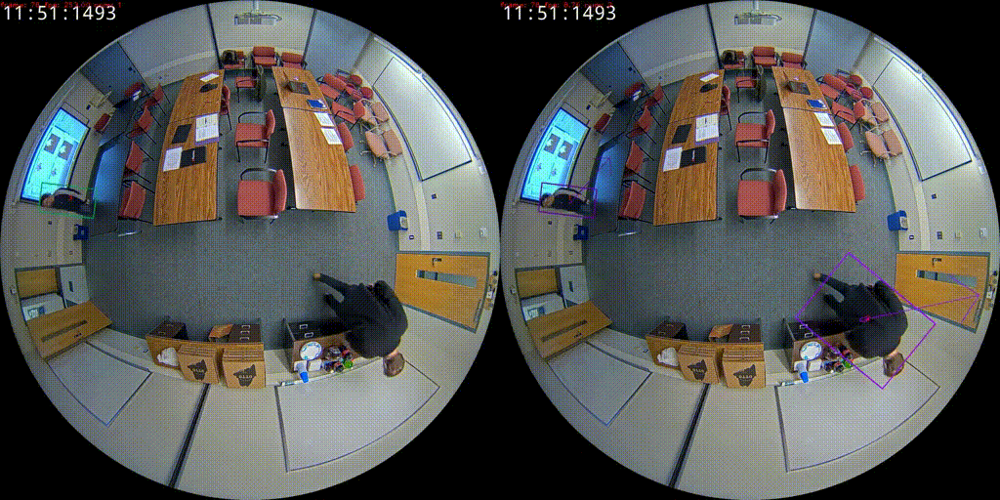

# DAFTrack: Distortion-Aware Multi-Object Tracking via Virtual Plane Projection in Overhead Fisheye Cameras

This repository provides the official implementation of <b>“Distortion-Aware Multi-Object Tracking via Virtual Plane Projection in Overhead Fisheye Cameras”</b>, a BMVC 2025 paper. The included code reproduces the results reported in the paper.


## Results

<p align="center">
    
    <br>
    <sup>
        Comparing <a
            href="https://bmva-archive.org.uk/bmvc/2024/papers/Paper_257/paper.pdf">
            RF-Tracker
        </a> (left) with <a
            href="https://github.com/PanithiVanasirikul/DAFTrack">
            DAFTrack
        </a> (right) on the CEPDOF's Lunch1 scene.
        Our method shows superior tracking performance in overhead fisheye camera scenarios.
    </sup>
</p>

### CEPDOF Dataset
<div align="center">

| Tracker | HOTA ↑ | DetA ↑ | MOTA ↑ | IDF1 ↑ | AssA ↑ | IDS ↓ |
|---------|--------|--------|--------|--------|--------|-------|
| **General-purpose Trackers** | | | | | | |
| BoT-SORT | 46.9 | 70.8 | 68.1 | 52.6 | 33.2 | 1392 |
| OC-SORT | 47.5 | 75.1 | 77.6 | 47.5 | 31.8 | 11654 |
| ByteTrack | 49.5 | 77.1 | 78.3 | 49.0 | 33.6 | 1030 |
| **Fisheye Trackers** | | | | | | |
| HDA | 51.9 | 79.5 | 79.4 | 51.8 | 36.0 | 1565 |
| RF-Tracker | 52.9 | 80.4 | 80.7 | 54.4 | 36.8 | 796 |
| **DAFTrack with gt (Ours)** | **59.0** | **83.0** | **83.2** | <ins>58.5</ins> | **44.0** | **700** |
| **DAFTrack with che (Ours)** | <ins>58.0</ins> | <ins>82.2</ins> | <ins>82.5</ins> | **58.8** | <ins>43.3</ins> | <ins>725</ins> |


<sup>Tracking performance comparison on the CEPDOF dataset. "gt" refers to using ground truth camera height, while "che" refers to using camera height estimation.</sup>
</div>


### WEPDTOF Dataset
<div align="center">

| Tracker | HOTA ↑ | DetA ↑ | MOTA ↑ | IDF1 ↑ | AssA ↑ | IDS ↓ |
|---------|--------|--------|--------|--------|--------|-------|
| **General-purpose Trackers** | | | | | | |
| BoT-SORT | 51.9 | 49.7 | 42.0 | 64.5 | 57.8 | 213 |
| OC-SORT | 57.9 | <ins>57.2</ins> | **50.6** | 65.2 | 59.9 | 329 |
| ByteTrack | 56.7 | 56.2 | 49.6 | 64.0 | 59.2 | 273 |
| **Fisheye Trackers** | | | | | | |
| HDA | 58.1 | 53.2 | 46.5 | 64.7 | <ins>66.2</ins> | <ins>183</ins> |
| RF-Tracker | <ins>59.3</ins> | 55.3 | 48.1 | <ins>66.4</ins> | 65.9 | **173** |
| DAFTrack with che (Ours) | **62.6** | **57.8** | <ins>50.4</ins> | **69.9** | **69.1** | 205 |

<sup>Tracking performance comparison on the WEPDTOF dataset. "che" refers to using camera height estimation.</sup>
</div>


## Requirements

- `Python 3.8` or `Conda`

## Setup

1. Create a virtual environment using:

    ```bash
    python -m venv env
    ```

    or using Conda:

    ```bash
    conda create -n daftrack python=3.8
    ```

2. Activate the virtual environment:
    - Venv:
        - On Windows:

        ```bash
        .\env\Scripts\activate
        ```

        - On Linux/Mac:

        ```bash
        source env/bin/activate
        ```
    
    - Conda:

        ```bash
        conda activate daftrack
        ```


3. Install the required packages using:

    ```bash
    pip install -r requirements.txt
    ```


4. Download [WEPDTOF](https://vip.bu.edu/projects/vsns/cossy/datasets/wepdtof/) and [CEPDOF](https://vip.bu.edu/projects/vsns/cossy/datasets/cepdof/)
    
    After finishing downloading and extracting, place the files in the `datasets` folder and unzip them. The directory structure should look like this:

    ```
    .
    ├── datasets
    │   ├── WEPDTOF
    │   ├── CEPDOF
    ```

    And remove all `__MACOSX` folders in the `datasets` folder and `.DS_Store` in every folders in `dataset` folder.

    Or you can use the following command to preprocess the datasets:

    - Linux/Mac:
        ```bash
        sh cleanup_datasets.sh
        ```
    - Windows:
        ```bat
        cleanup_datasets.bat
        ```


## Run benchmarking scripts

To reproduce the results in the paper, run the following commands:

- For WEPDTOF dataset:
   ```bash
   python all_demo.py --dataset WEPDTOF
   ```

- For CEPDOF dataset with ground truth camera height:
   ```
   python all_demo.py --dataset CEPDOF --camera_height 1.7
   ```

- For CEPDOF dataset without ground truth camera height:
   ```
   python all_demo.py --dataset CEPDOF
   ```